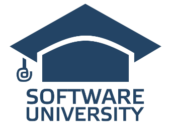

<h1 align="center">C# Advanced OOP</h1>

<h3>SoftUni Course</h3>

<h5><i>Summary:</i></h5>

<i>In the Object Oriented Programming (OOP) course you will learn about the principles and best practices for building quality software. You will become familiar with the concepts of writing quality code in the OOP C #. This includes using abstractions, refactoring, and writing unit tests, reflection, working with template data types, using events and techniques, and tools to improve the quality of the code. The course ends with development and defense of a practical course project and a practical exam.</i>

<ul>
	<li><a href="https://github.com/Gandjurov/AdvancedOOP_CSharp/tree/master/01.SolidPrinciples">Solid Principles</a></li>
	<li><a href="https://github.com/Gandjurov/AdvancedOOP_CSharp/tree/master/02.Generics">Generics</a></li>
	<li><a href="https://github.com/Gandjurov/AdvancedOOP_CSharp/tree/master/03.IteratorsAndComparators">Iterators And Comparators</a></li>
	<li><a href="https://github.com/Gandjurov/AdvancedOOP_CSharp/tree/master/04.ReflectionAndAttributes">Reflection And Attributes</a></li>
	<li><a href="https://github.com/Gandjurov/AdvancedOOP_CSharp/tree/master/05.UnitTesting">Unit Testing</a></li>
	<li><a href="https://github.com/Gandjurov/AdvancedOOP_CSharp/tree/master/06.Workshop-DependancyInjention">Workshop - Dependancy Injention</a></li>
	<li><a href="https://github.com/Gandjurov/AdvancedOOP_CSharp/tree/master/07.Workshop-StorageMaster">Workshop - Storage Master</a></li>
	<li><a href="https://github.com/Gandjurov/AdvancedOOP_CSharp/tree/master/08.ExamPreparation">ExamPreparation</a></li>
</ul>
